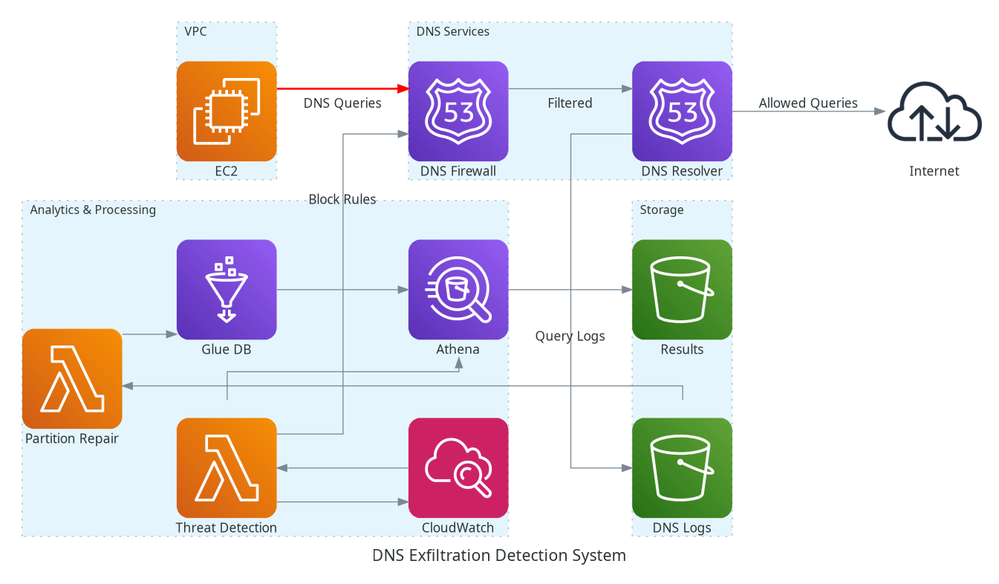

# DNS Exfiltration Detection and Protection System

A real-time DNS threat detection and automated protection system built on AWS that monitors Route 53 Resolver DNS logs to identify malicious DNS patterns and automatically blocks suspicious domains via Route 53 DNS Firewall.

## Quick Start

**55-second end-to-end protection:** From DNS traffic to automated blocking in under a minute.

```bash
# Deploy the complete infrastructure
make deploy

# Generate test traffic
ssh ec2-user@<instance-ip> -i ~/.ssh/id_rsa
for i in {1..250}; do dig "$(openssl rand -hex 3).dnsdemo.andrewrea.co.uk"; done

# Monitor detection and blocking in CloudWatch logs
```

## Architecture Overview

The system implements a three-layer, event-driven pipeline that collects every DNS query, analyzes it in near-real time, and pushes blocks straight back into Route 53 DNS Firewall:



### Data Collection Layer
- **Route 53 Resolver** streams every DNS lookup from the VPC directly to S3 (bypassing CloudWatch for performance)
- **VPC-level DNS logging** captures all DNS activity from EC2 instances  
- **S3 buckets** store both raw DNS logs and Athena query results with independent retention policies

### Analysis Layer
- **AWS Glue** provides schema management and Public Suffix List (PSL) data for accurate apex domain extraction
- **Amazon Athena** executes threat detection queries with 5-minute windows for real-time detection
- **Partition Repair Lambda** (`lambdas/partition-repair/`) automatically runs `MSCK REPAIR TABLE` when new log files arrive
- **Three detection patterns:**
  - High-frequency queries (>20 requests/5min to same apex domain)
  - Data encoding detection (base64/hex patterns in subdomains)
  - Subdomain enumeration (reconnaissance detection)

### Response Layer
- **Threat Detection Lambda** (`lambdas/threat-detection/`) runs on 1-minute schedule, pulls Athena results
- **Route 53 DNS Firewall** automatically blocks domains identified as HIGH/CRITICAL severity
- **Intelligent blocking logic:** >10 unique subdomains triggers wildcard block (`*.domain.com`), otherwise blocks apex domain
- **GuardDuty integration** provides additional ML-based threat detection and validation

## Detection Timeline

**Actual measured performance (55s end-to-end):**

1. **11:58:14** – DNS queries logged to S3
2. **11:58:15** – Partition repair triggered (< 1s)  
3. **11:59:09** – Threat detected & firewall rule created
4. **Total: 55 seconds** from DNS traffic to automated blocking

## Key Features

### Real-Time Threat Detection
- **5-minute detection windows** for immediate threat identification
- **Automated blocking** within 60 seconds of threat detection
- **Public Suffix List integration** prevents false positives (e.g., correctly parses `data1.evil.example.co.uk` → `example.co.uk`)
- **Deterministic query ordering** ensures consistent results across time periods

### Intelligent Blocking Logic
- **Wildcard blocking:** >10 unique subdomains → `*.domain.com` block
- **Apex blocking:** ≤10 subdomains → `domain.com` block  
- **Severity-based response:** Only HIGH/CRITICAL threats trigger automatic blocking
- **Duplicate prevention:** Automatic deduplication of blocking rules

### Cost-Optimized Design
- **Direct S3 logging** bypasses expensive CloudWatch Logs ingestion
- **Partition-based queries** scan only latest 5-minute windows
- **Serverless architecture** scales automatically with traffic

## Infrastructure Components

| Component | Purpose | Key Configuration |
|-----------|---------|-------------------|
| **VPC & EC2** | Test environment and traffic generation | `m5.large` instance in `eu-west-2a` |
| **Route 53 Resolver** | DNS query logging and resolution | Logs directly to S3, bypasses CloudWatch |
| **Route 53 DNS Firewall** | Automated threat blocking | Supports wildcard and apex domain blocking |
| **S3 Buckets** | Log storage and query results | Separate buckets for logs/results |
| **AWS Glue** | Schema management and PSL data | Public Suffix List for apex domain extraction |
| **Amazon Athena** | Real-time threat detection queries | 5-minute window queries, deterministic ordering |
| **Lambda Functions** | Automation and response | Partition repair + threat detection |
| **GuardDuty** | Secondary threat validation | ML-based DNS exfiltration detection |

## Deployment

### Prerequisites
- AWS CLI configured with appropriate permissions
- Terraform >= 5.35.0
- SSH key pair for EC2 access
- Python 3.12+ for Lambda functions

### Quick Deployment
```bash
# Initialize Terraform
make init

# Plan and review changes  
make plan

# Deploy complete infrastructure (~66 seconds)
make deploy

# Clean up when done
make destroy
```

### Available Make Targets
```bash
make help              # Show all available commands
make build-lambdas     # Build Lambda deployment packages
make plan             # Run terraform plan
make deploy           # Deploy infrastructure + upload PSL data  
make destroy          # Destroy all infrastructure
make clean            # Remove build artifacts
make update-psl       # Update Public Suffix List data
```

## Testing

### Generating Test Traffic
```bash
# SSH to test instance
ssh ec2-user@<instance-ip> -i ~/.ssh/id_rsa

# Generate high-frequency DNS queries (triggers detection)
for i in {1..250}; do
  dig "$(openssl rand -hex 3).dnsdemo.andrewrea.co.uk"
done
```

### Monitoring Detection
- **CloudWatch Logs:** `/aws/events/guardduty-dns-findings`
- **Athena Console:** Workgroup `dns-exfiltration-analysis`
- **DNS Firewall Rules:** Route 53 Console → DNS Firewall
- **S3 Logs:** Check bucket for DNS query logs (5-10 minute delay)

### Expected Results
1. **High-frequency queries detected** within 5 minutes
2. **Blocking rule created** in DNS Firewall within 60 seconds
3. **Subsequent queries blocked** (test with new random subdomains)
4. **GuardDuty findings** logged for validation

## Detection Queries

### High-Frequency Exfiltration Detection
```sql
SELECT
  CASE 
    WHEN cardinality(labels) > suffix_len THEN
      concat(element_at(labels, cardinality(labels) - suffix_len), '.', suffix)
    ELSE suffix
  END AS apex_domain,
  count(*) AS query_count,
  count(DISTINCT srcaddr) AS source_count,
  count(DISTINCT fqdn) AS unique_subdomains,
  'HIGH_FREQUENCY' AS threat_type,
  CASE 
    WHEN count(*) > 100 THEN 'CRITICAL'
    WHEN count(*) > 50 THEN 'HIGH' 
    WHEN count(*) > 20 THEN 'MEDIUM'
    ELSE 'LOW'
  END AS severity
FROM dns_with_psl_joined
WHERE cardinality(labels) > suffix_len + 1  -- Only subdomains
GROUP BY apex_domain
HAVING count(*) > 20  -- 5-minute threshold
ORDER BY query_count DESC
```

### Future Detection Patterns
- **High-entropy subdomains** (base64/hex encoding detection)
- **Unusually long domain names** (>100 characters)  
- **Uncommon query types** (TXT, NULL, CNAME abuse)
- **Subdomain enumeration** (reconnaissance detection)
- **LLM-assisted log analysis** for pattern discovery

## Cost Estimates

| Traffic Level | Daily Queries | Monthly Cost |
|---------------|---------------|--------------|
| **Low** | 10,000 | ~$30 |
| **Medium** | 500,000 | ~$95 |
| **High** | 10,000,000 | ~$520 |

*Costs include Lambda, S3, Athena, Route 53 services. Excludes EC2 instances.*

## Commercial Comparison

| Solution | Detection Method | Reaction Time | Block Scope |
|----------|------------------|---------------|-------------|
| **This AWS Pipeline** | Unique subdomains >20/5min | ~55s | Per domain, persistent |
| **PowerDNS dnsdist** | High cache-miss ratio | Milliseconds | Per client, auto-expires |
| **Enterprise Solutions** | Various ML/signatures | Varies | Policy-dependent |

## Development

### Lambda Functions
- **`lambdas/partition-repair/`** - S3 event-triggered partition management
- **`lambdas/threat-detection/`** - Scheduled threat detection and blocking

### Build System
The Makefile automatically discovers Lambda functions and creates deployment packages with proper dependency handling:

```bash
# Automatic discovery of Lambda directories
LAMBDA_DIRS := $(shell find lambdas -maxdepth 1 -type d ! -name lambdas)

# Build specific Lambda  
make infrastructure/threat_detection.zip

# Build all Lambdas
make build-lambdas
```

### Public Suffix List Integration
The system uses PSL data to correctly extract apex domains from complex DNS names:

```bash
# Update PSL data
make update-psl

# Manual PSL processing
scripts/update_psl.sh
```

## Security Considerations

- **IAM roles** follow least-privilege principle
- **VPC security groups** restrict access to SSH only
- **DNS logging** captures all queries for forensic analysis
- **Automated blocking** prevents ongoing data exfiltration
- **GuardDuty integration** provides secondary validation
- **No secrets in logs** - all sensitive data excluded

## Known DNS Tunneling Tools

This system is designed to detect activity from tools including:
- **[iodine](https://github.com/yarrick/iodine)** - DNS tunnel for IPv4 data
- **[dnscat2](https://github.com/iagox86/dnscat2)** - Encrypted C&C over DNS
- **Custom scripts** using base64/hex encoding in subdomains

## Troubleshooting

### Common Issues
1. **DNS logs not appearing** - Wait 5-10 minutes for Route 53 Resolver logging delay
2. **Athena queries failing** - Check Glue table partitions with `MSCK REPAIR TABLE`
3. **Lambda timeouts** - Review CloudWatch logs for specific error details
4. **Firewall rules not working** - Verify VPC association and rule priority

### Debug Commands
```bash
# Check Athena table partitions
aws athena start-query-execution --query-string "MSCK REPAIR TABLE dns_logs"

# List current firewall rules  
aws route53resolver list-firewall-domains --firewall-domain-list-id <list-id>

# View Lambda logs
aws logs tail /aws/lambda/threat-detection --follow
```

## Contributing

1. Fork the repository
2. Create a feature branch
3. Test changes with `make plan`
4. Submit a pull request

## License

This project is licensed under the MIT License - see the LICENSE file for details.

## References

- [AWS Route 53 Resolver DNS Firewall](https://docs.aws.amazon.com/Route53/latest/DeveloperGuide/resolver-dns-firewall.html)
- [Amazon Athena SQL Reference](https://docs.aws.amazon.com/athena/latest/ug/language-reference.html)
- [Public Suffix List](https://publicsuffix.org/)
- [PowerDNS dnsdist Dynamic Blocking](https://github.com/PowerDNS/pdns/issues/7380)